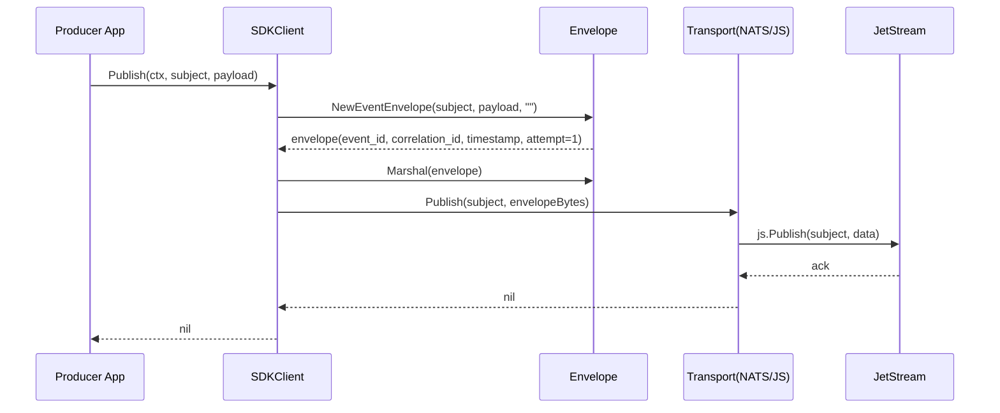
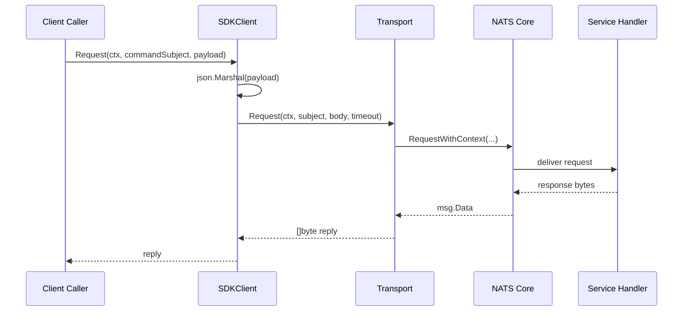
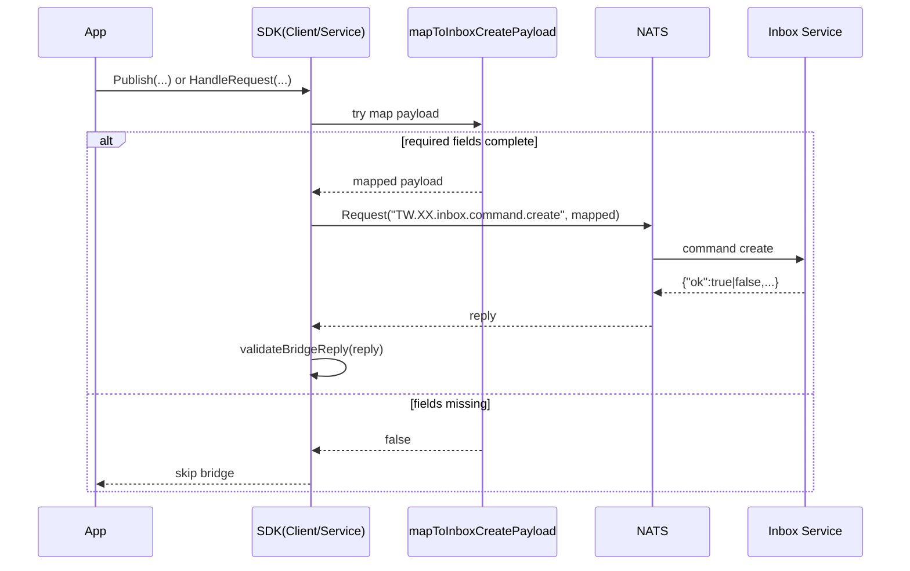

# EventSDK 閱讀指南

## 🗺️ 先建立地圖（約 5 分鐘）

### 1. 先看 API 介面與資料模型
- `/sdk/interfaces.go`
- `/sdk/types.go`

### 2. 三個核心角色
- **Client**
    - 負責發送 `Publish` / `Request`
- **Service**
    - 負責接收 `Subscribe` / `HandleRequest`
- **Transport**
    - 抽象底層（NATS / JetStream）

---

## 🔍 看主流程（約 15 分鐘）

### 📤 發送端（client.go）
- 路徑：`/sdk/client.go`

**核心功能**
- `Publish`
    - 將 payload 包成 envelope 後送到 JetStream
- `Request`
    - 使用 request-reply 模式直接發送

---

### 📥 接收端（service.go）
- 路徑：`/sdk/service.go`

**核心功能**
- `Subscribe`
    - 解 envelope
    - 轉成 `sdk.Message`
    - 最後執行 Ack
- `HandleRequest`
    - 註冊 command handler
    - 回傳 reply

---

### 📦 Envelope 規格
- 路徑：`/sdk/internal/envelope/envelope.go`

**SDK 自動補齊欄位**
- `event_id`
- `correlation_id`
- `timestamp`
- `attempt`

---

## ⚙️ 看底層與啟動（約 10 分鐘）

### 1. Bootstrap（初始化）
- 路徑：`/sdk/bootstrap/bootstrap.go`
- 功能：
    - 建立 Client / Service
    - 建立連線

---

### 2. NATS Transport 實作
- 路徑：`/sdk/internal/transport/nats/transport.go`

---

### 3. 可執行範例（⭐ 最推薦實際跑）
- **Consumer**
    - `/sdk/examples/consumer/main.go`
- **Producer**
    - `/sdk/examples/producer/main.go`

---

## 🧠 建議閱讀順序（快速理解）

1. `interfaces.go` / `types.go`（理解抽象）
2. `client.go` / `service.go`（掌握主流程）
3. `envelope.go`（理解資料封裝）
4. `bootstrap.go`（理解初始化）
5. `examples/`（實際驗證）

---

## ✅ 一句話總結

> 這個 SDK 是一個「以 envelope 為核心，封裝 NATS/JetStream 的事件驅動框架」，  
> 讓你用 Client / Service 模式完成 pub-sub + request-reply。

參考mermaid 1

參考mermaid 2

參考mermaid 3
